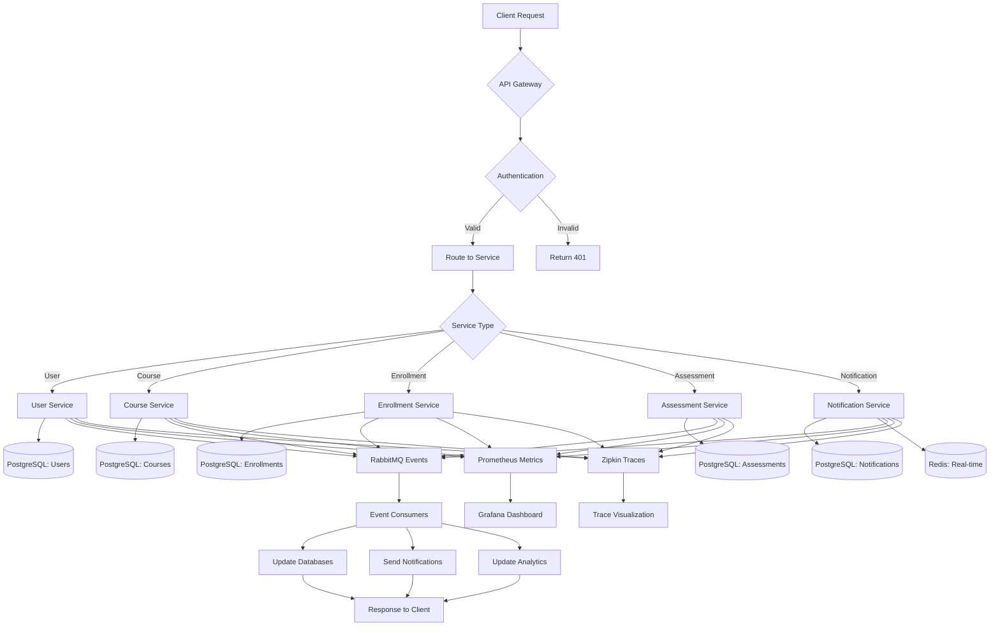

# AI-Powered Learning Management System - Backend Architecture



## Overview

The AI-Powered Learning Management System (LMS) is designed as a microservices-based architecture using Spring Boot 3, Spring WebFlux, and modern cloud-native technologies. The system provides comprehensive learning management capabilities with real-time features, AI integration, and scalable infrastructure.

## Technology Stack

### Core Technologies
- **Framework**: Spring Boot 3.x with Spring WebFlux
- **Database**: PostgreSQL (primary), Redis (caching/sessions)
- **Message Broker**: RabbitMQ
- **API Gateway**: Spring Cloud Gateway
- **Containerization**: Docker
- **Orchestration**: Kubernetes
- **Monitoring**: Prometheus + Grafana
- **Tracing**: Spring Sleuth + Zipkin
- **Resilience**: Resilience4j

### Development Tools
- **Build Tool**: Maven/Gradle
- **Testing**: JUnit 5, TestContainers
- **Documentation**: OpenAPI 3.0 (Swagger)
- **Code Quality**: SonarQube, SpotBugs

## Microservices Architecture

### 1. User Service
**Port**: 8081
**Database**: PostgreSQL (users schema)

#### Responsibilities:
- User registration, authentication, and authorization
- Profile management and preferences
- Role-based access control (Student, Instructor, Admin)
- User analytics and behavior tracking
- Integration with external identity providers

#### Key Features:
- JWT-based authentication
- OAuth2 integration
- Multi-factor authentication
- User activity tracking
- Profile customization

#### API Endpoints:
```
POST   /api/v1/auth/register
POST   /api/v1/auth/login
GET    /api/v1/users/profile
PUT    /api/v1/users/profile
GET    /api/v1/users/{id}
DELETE /api/v1/users/{id}
```

### 2. Course Service
**Port**: 8082
**Database**: PostgreSQL (courses schema)

#### Responsibilities:
- Course CRUD operations
- Content management and version control
- Course categorization and tagging
- Search and filtering capabilities
- Content upload and storage management

#### Key Features:
- File upload with version control
- Rich text editor integration
- Course templates and cloning
- Advanced search with Elasticsearch
- Content approval workflows

#### API Endpoints:
```
GET    /api/v1/courses
POST   /api/v1/courses
GET    /api/v1/courses/{id}
PUT    /api/v1/courses/{id}
DELETE /api/v1/courses/{id}
POST   /api/v1/courses/{id}/content
GET    /api/v1/courses/search
```

### 3. Enrollment Service
**Port**: 8083
**Database**: PostgreSQL (enrollments schema)

#### Responsibilities:
- Student enrollment management
- Course access control
- Progress tracking and analytics
- Certificate generation
- Enrollment analytics

#### Key Features:
- Enrollment workflows
- Progress calculation
- Certificate templates
- Learning path management
- Cohort analysis

#### API Endpoints:
```
POST   /api/v1/enrollments
GET    /api/v1/enrollments/user/{userId}
PUT    /api/v1/enrollments/{id}/progress
GET    /api/v1/enrollments/{id}/certificate
DELETE /api/v1/enrollments/{id}
```

### 4. Assessment Service
**Port**: 8084
**Database**: PostgreSQL (assessments schema)

#### Responsibilities:
- Quiz and exam creation
- Question bank management
- Automated grading
- Performance analytics
- Plagiarism detection

#### Key Features:
- Multiple question types (MCQ, Essay, Code)
- Automated grading for objective questions
- AI-powered plagiarism detection
- Performance analytics
- Adaptive testing

#### API Endpoints:
```
POST   /api/v1/assessments
GET    /api/v1/assessments/course/{courseId}
POST   /api/v1/assessments/{id}/submit
GET    /api/v1/assessments/{id}/results
PUT    /api/v1/assessments/{id}/grade
```

### 5. Notification Service
**Port**: 8085
**Database**: PostgreSQL (notifications schema), Redis (real-time)

#### Responsibilities:
- Email, SMS, and push notifications
- Real-time notifications via WebSocket
- Notification templates
- Delivery tracking
- Preference management

#### Key Features:
- Multi-channel notifications
- Template engine
- Delivery status tracking
- Notification preferences
- Bulk notifications

#### API Endpoints:
```
POST   /api/v1/notifications
GET    /api/v1/notifications/user/{userId}
PUT    /api/v1/notifications/{id}/read
DELETE /api/v1/notifications/{id}
```

## Data Architecture

### Database Design

#### PostgreSQL Schemas:
1. **users** - User management and authentication
2. **courses** - Course content and metadata
3. **enrollments** - Student enrollments and progress
4. **assessments** - Quizzes, exams, and results
5. **notifications** - Notification history and templates

#### Redis Usage:
- Session storage
- Real-time data caching
- WebSocket session management
- Rate limiting
- Temporary data storage

### Data Flow Patterns

#### Event-Driven Architecture:
```
User Action → Service → RabbitMQ → Event Consumers → Database Updates
```

#### Real-time Communication:
```
WebSocket → Redis Pub/Sub → Connected Clients
```

## Security Architecture

### Authentication & Authorization
- **JWT Tokens**: Stateless authentication
- **OAuth2**: Third-party integrations
- **Role-Based Access Control**: Fine-grained permissions
- **API Rate Limiting**: Protection against abuse

### Data Security
- **Encryption**: Data at rest and in transit
- **Input Validation**: Comprehensive sanitization
- **SQL Injection Prevention**: Parameterized queries
- **XSS Protection**: Content Security Policy

## API Gateway Design

### Spring Cloud Gateway Features:
- **Routing**: Service discovery and load balancing
- **Rate Limiting**: Per-user and per-service limits
- **Circuit Breaking**: Resilience4j integration
- **Authentication**: JWT validation
- **CORS**: Cross-origin resource sharing
- **Logging**: Request/response logging

### Gateway Routes:
```
/api/v1/users/** → User Service
/api/v1/courses/** → Course Service
/api/v1/enrollments/** → Enrollment Service
/api/v1/assessments/** → Assessment Service
/api/v1/notifications/** → Notification Service
```

## Monitoring & Observability

### Metrics Collection
- **Micrometer**: Application metrics
- **Prometheus**: Metrics scraping and storage
- **Grafana**: Visualization and alerting

### Distributed Tracing
- **Spring Sleuth**: Trace ID propagation
- **Zipkin**: Trace visualization
- **Custom Spans**: Business logic tracing

### Logging
- **Structured Logging**: JSON format
- **Centralized Logging**: ELK Stack
- **Log Correlation**: Trace ID integration

## Resilience Patterns

### Circuit Breaker (Resilience4j)
- **Service-to-Service**: Inter-service communication
- **External APIs**: Third-party integrations
- **Database**: Connection pool management

### Retry Patterns
- **Exponential Backoff**: Progressive delays
- **Jitter**: Random delay variation
- **Maximum Attempts**: Prevent infinite loops

### Bulkhead Pattern
- **Thread Pools**: Isolated execution contexts
- **Connection Pools**: Database connection isolation
- **Resource Limits**: Memory and CPU constraints

## Deployment Architecture

### Container Strategy
- **Multi-stage Docker**: Optimized image sizes
- **Health Checks**: Application readiness
- **Resource Limits**: CPU and memory constraints

### Kubernetes Deployment
- **Service Mesh**: Istio for advanced routing
- **Auto-scaling**: Horizontal Pod Autoscaler
- **Resource Management**: Requests and limits
- **Secrets Management**: Kubernetes secrets

### CI/CD Pipeline
- **GitHub Actions**: Automated builds
- **Docker Registry**: Image storage
- **Helm Charts**: Kubernetes deployment
- **ArgoCD**: GitOps deployment

## Performance Optimization

### Caching Strategy
- **Redis Caching**: Frequently accessed data
- **Database Query Optimization**: Indexing strategy
- **CDN Integration**: Static content delivery
- **Response Compression**: Gzip compression

### Database Optimization
- **Connection Pooling**: HikariCP
- **Query Optimization**: Prepared statements
- **Indexing Strategy**: Composite indexes
- **Partitioning**: Large table management

## Scalability Considerations

### Horizontal Scaling
- **Stateless Services**: Easy replication
- **Load Balancing**: Round-robin distribution
- **Database Sharding**: Data distribution
- **Cache Distribution**: Redis cluster

### Vertical Scaling
- **Resource Monitoring**: CPU and memory usage
- **Performance Tuning**: JVM optimization
- **Database Optimization**: Query performance
- **Network Optimization**: Connection pooling

## Disaster Recovery

### Backup Strategy
- **Database Backups**: Automated daily backups
- **Configuration Backups**: Infrastructure as Code
- **Data Replication**: Cross-region replication

### Recovery Procedures
- **RTO/RPO**: Recovery time and point objectives
- **Failover Procedures**: Automated failover
- **Data Restoration**: Backup restoration process

## Security Compliance

### Data Protection
- **GDPR Compliance**: Data privacy regulations
- **Data Encryption**: End-to-end encryption
- **Audit Logging**: Comprehensive audit trails
- **Access Controls**: Principle of least privilege

### API Security
- **OAuth2**: Authorization framework
- **API Keys**: Service-to-service authentication
- **Rate Limiting**: Abuse prevention
- **Input Validation**: Security sanitization 