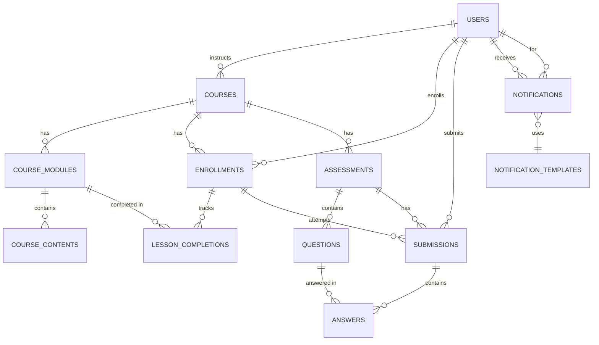

# Database Schema & ER Diagram for AI-Powered LMS

## 1. Schema Definition (PostgreSQL)

### User Service
```sql
CREATE TABLE users (
    id UUID PRIMARY KEY DEFAULT gen_random_uuid(),
    email VARCHAR(255) UNIQUE NOT NULL,
    password_hash VARCHAR(255) NOT NULL,
    full_name VARCHAR(255) NOT NULL,
    role VARCHAR(32) NOT NULL, -- STUDENT, INSTRUCTOR, ADMIN
    profile_picture VARCHAR(255),
    preferences JSONB,
    created_at TIMESTAMP NOT NULL DEFAULT NOW(),
    updated_at TIMESTAMP NOT NULL DEFAULT NOW()
);
```

### Course Service
```sql
CREATE TABLE courses (
    id UUID PRIMARY KEY DEFAULT gen_random_uuid(),
    title VARCHAR(255) NOT NULL,
    description TEXT,
    instructor_id UUID NOT NULL REFERENCES users(id),
    status VARCHAR(32) NOT NULL, -- DRAFT, PUBLISHED, ARCHIVED
    version INT NOT NULL DEFAULT 1,
    created_at TIMESTAMP NOT NULL DEFAULT NOW(),
    updated_at TIMESTAMP NOT NULL DEFAULT NOW()
);

CREATE TABLE course_modules (
    id UUID PRIMARY KEY DEFAULT gen_random_uuid(),
    course_id UUID NOT NULL REFERENCES courses(id) ON DELETE CASCADE,
    title VARCHAR(255) NOT NULL,
    content TEXT,
    order_index INT NOT NULL,
    created_at TIMESTAMP NOT NULL DEFAULT NOW()
);

CREATE TABLE course_contents (
    id UUID PRIMARY KEY DEFAULT gen_random_uuid(),
    module_id UUID NOT NULL REFERENCES course_modules(id) ON DELETE CASCADE,
    file_url VARCHAR(255),
    file_type VARCHAR(64),
    version INT NOT NULL DEFAULT 1,
    uploaded_at TIMESTAMP NOT NULL DEFAULT NOW()
);
```

### Enrollment Service
```sql
CREATE TABLE enrollments (
    id UUID PRIMARY KEY DEFAULT gen_random_uuid(),
    course_id UUID NOT NULL REFERENCES courses(id) ON DELETE CASCADE,
    student_id UUID NOT NULL REFERENCES users(id),
    status VARCHAR(32) NOT NULL, -- ACTIVE, COMPLETED, CANCELLED
    progress NUMERIC(5,2) NOT NULL DEFAULT 0.0,
    enrolled_at TIMESTAMP NOT NULL DEFAULT NOW(),
    completed_at TIMESTAMP,
    certificate_url VARCHAR(255)
);

CREATE TABLE lesson_completions (
    id UUID PRIMARY KEY DEFAULT gen_random_uuid(),
    enrollment_id UUID NOT NULL REFERENCES enrollments(id) ON DELETE CASCADE,
    module_id UUID NOT NULL REFERENCES course_modules(id),
    lesson_id UUID NOT NULL,
    completed_at TIMESTAMP NOT NULL DEFAULT NOW(),
    time_spent INT NOT NULL, -- seconds
    score NUMERIC(5,2)
);
```

### Assessment Service
```sql
CREATE TABLE assessments (
    id UUID PRIMARY KEY DEFAULT gen_random_uuid(),
    course_id UUID NOT NULL REFERENCES courses(id) ON DELETE CASCADE,
    title VARCHAR(255) NOT NULL,
    type VARCHAR(32) NOT NULL, -- QUIZ, EXAM
    created_at TIMESTAMP NOT NULL DEFAULT NOW()
);

CREATE TABLE questions (
    id UUID PRIMARY KEY DEFAULT gen_random_uuid(),
    assessment_id UUID NOT NULL REFERENCES assessments(id) ON DELETE CASCADE,
    question_text TEXT NOT NULL,
    question_type VARCHAR(32) NOT NULL, -- MCQ, ESSAY, CODE
    options JSONB, -- For MCQ
    correct_answer JSONB, -- For auto-grading
    points INT NOT NULL DEFAULT 1
);

CREATE TABLE submissions (
    id UUID PRIMARY KEY DEFAULT gen_random_uuid(),
    assessment_id UUID NOT NULL REFERENCES assessments(id) ON DELETE CASCADE,
    student_id UUID NOT NULL REFERENCES users(id),
    submitted_at TIMESTAMP NOT NULL DEFAULT NOW(),
    score NUMERIC(5,2),
    graded BOOLEAN DEFAULT FALSE
);

CREATE TABLE answers (
    id UUID PRIMARY KEY DEFAULT gen_random_uuid(),
    submission_id UUID NOT NULL REFERENCES submissions(id) ON DELETE CASCADE,
    question_id UUID NOT NULL REFERENCES questions(id),
    answer JSONB,
    is_correct BOOLEAN
);
```

### Notification Service
```sql
CREATE TABLE notifications (
    id UUID PRIMARY KEY DEFAULT gen_random_uuid(),
    user_id UUID NOT NULL REFERENCES users(id),
    type VARCHAR(32) NOT NULL, -- EMAIL, SMS, PUSH, IN_APP
    content TEXT NOT NULL,
    status VARCHAR(32) NOT NULL, -- SENT, DELIVERED, READ, FAILED
    created_at TIMESTAMP NOT NULL DEFAULT NOW(),
    read_at TIMESTAMP
);

CREATE TABLE notification_templates (
    id UUID PRIMARY KEY DEFAULT gen_random_uuid(),
    type VARCHAR(32) NOT NULL,
    subject VARCHAR(255),
    body TEXT NOT NULL,
    created_at TIMESTAMP NOT NULL DEFAULT NOW()
);
```

---

## 2. ER Diagram (Mermaid)



---

This schema and ER diagram provide a normalized, scalable foundation for the LMS backend, supporting all required features and microservices. 