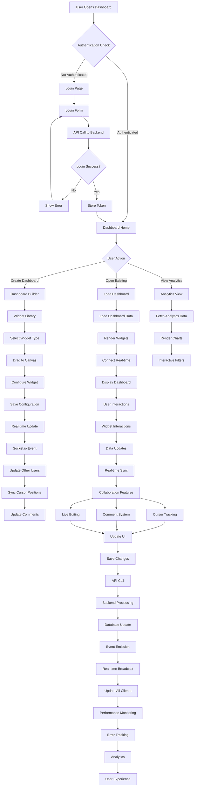

# AI-Powered Dashboard Platform - Frontend Architecture



---

## Overview

The AI-Powered Dashboard Platform is a modern, real-time collaborative dashboard builder built with Next.js 14, TypeScript, and cutting-edge frontend technologies. The platform enables users to create, customize, and share interactive dashboards with real-time data visualization and collaborative editing capabilities.

## Technology Stack

### Core Technologies
- **Framework**: Next.js 14 (App Router)
- **Language**: TypeScript
- **Styling**: Tailwind CSS
- **State Management**: Zustand
- **Data Fetching**: React Query (TanStack Query)
- **Charts**: Chart.js with react-chartjs-2
- **Real-time**: Socket.io Client
- **Drag & Drop**: React DnD
- **Forms**: React Hook Form + Zod
- **Icons**: Lucide React

### Development Tools
- **Build Tool**: Vite (via Next.js)
- **Testing**: Jest + React Testing Library
- **Linting**: ESLint + Prettier
- **Type Checking**: TypeScript
- **Package Manager**: npm/yarn/pnpm

### Deployment & Monitoring
- **Hosting**: Vercel
- **Analytics**: Vercel Analytics
- **Error Tracking**: Sentry
- **Performance**: Core Web Vitals monitoring

## Architecture Overview

### 1. Application Structure

```
dashboard-platform/
├── app/                          # Next.js App Router
│   ├── (auth)/                   # Authentication routes
│   ├── (dashboard)/              # Dashboard routes
│   ├── api/                      # API routes
│   ├── globals.css              # Global styles
│   └── layout.tsx               # Root layout
├── components/                   # Reusable components
│   ├── ui/                      # Base UI components
│   ├── charts/                  # Chart components
│   ├── dashboard/               # Dashboard-specific components
│   └── forms/                   # Form components
├── lib/                         # Utilities and configurations
│   ├── store/                   # Zustand stores
│   ├── hooks/                   # Custom hooks
│   ├── utils/                   # Utility functions
│   └── validations/             # Zod schemas
├── types/                       # TypeScript type definitions
├── public/                      # Static assets
└── tests/                       # Test files
```

### 2. State Management Architecture

#### Zustand Store Structure

```typescript
// lib/store/dashboard-store.ts
interface DashboardState {
  // Dashboard data
  dashboards: Dashboard[]
  currentDashboard: Dashboard | null
  selectedWidgets: string[]
  
  // UI state
  isEditing: boolean
  isCollaborating: boolean
  activeUsers: User[]
  
  // Real-time state
  cursorPositions: Record<string, CursorPosition>
  comments: Comment[]
  
  // Actions
  createDashboard: (data: CreateDashboardData) => void
  updateDashboard: (id: string, updates: Partial<Dashboard>) => void
  deleteDashboard: (id: string) => void
  selectWidget: (widgetId: string) => void
  addWidget: (widget: Widget) => void
  updateWidget: (widgetId: string, updates: Partial<Widget>) => void
  removeWidget: (widgetId: string) => void
  setEditingMode: (editing: boolean) => void
  updateCursorPosition: (userId: string, position: CursorPosition) => void
  addComment: (comment: Comment) => void
}

// lib/store/user-store.ts
interface UserState {
  user: User | null
  isAuthenticated: boolean
  preferences: UserPreferences
  
  login: (credentials: LoginCredentials) => Promise<void>
  logout: () => void
  updatePreferences: (preferences: Partial<UserPreferences>) => void
}

// lib/store/real-time-store.ts
interface RealTimeState {
  socket: Socket | null
  isConnected: boolean
  activeCollaborators: User[]
  
  connect: () => void
  disconnect: () => void
  joinDashboard: (dashboardId: string) => void
  leaveDashboard: (dashboardId: string) => void
  sendCursorUpdate: (position: CursorPosition) => void
  sendComment: (comment: Comment) => void
}
```

### 3. Component Architecture

#### 3.1 Widget System

```typescript
// types/widget.ts
interface BaseWidget {
  id: string
  type: WidgetType
  title: string
  position: Position
  size: Size
  config: WidgetConfig
  dataSource: DataSource
  refreshInterval?: number
}

interface ChartWidget extends BaseWidget {
  type: 'chart'
  config: ChartConfig
  chartType: ChartType
}

interface TableWidget extends BaseWidget {
  type: 'table'
  config: TableConfig
  columns: Column[]
}

interface MetricWidget extends BaseWidget {
  type: 'metric'
  config: MetricConfig
  value: number
  trend: TrendData
}

// components/widgets/WidgetFactory.tsx
const WidgetFactory: React.FC<{ widget: BaseWidget }> = ({ widget }) => {
  const widgetComponents = {
    chart: ChartWidget,
    table: TableWidget,
    metric: MetricWidget,
    text: TextWidget,
    image: ImageWidget,
    iframe: IframeWidget
  }
  
  const WidgetComponent = widgetComponents[widget.type]
  return <WidgetComponent widget={widget} />
}
```

#### 3.2 Dashboard Builder

```typescript
// components/dashboard/DashboardBuilder.tsx
const DashboardBuilder: React.FC<{ dashboard: Dashboard }> = ({ dashboard }) => {
  const { widgets, addWidget, updateWidget, removeWidget } = useDashboardStore()
  const { isEditing, setEditingMode } = useDashboardStore()
  
  return (
    <div className="dashboard-builder">
      <DashboardToolbar 
        isEditing={isEditing}
        onToggleEdit={() => setEditingMode(!isEditing)}
        onAddWidget={addWidget}
      />
      
      <WidgetLibrary isVisible={isEditing} />
      
      <DashboardCanvas>
        {widgets.map(widget => (
          <DraggableWidget
            key={widget.id}
            widget={widget}
            isEditing={isEditing}
            onUpdate={updateWidget}
            onRemove={removeWidget}
          />
        ))}
      </DashboardCanvas>
      
      <CollaborationPanel />
    </div>
  )
}
```

### 4. Real-time Communication

#### 4.1 Socket.io Integration

```typescript
// lib/socket.ts
class DashboardSocket {
  private socket: Socket | null = null
  private dashboardId: string | null = null
  
  connect(token: string) {
    this.socket = io(process.env.NEXT_PUBLIC_SOCKET_URL!, {
      auth: { token },
      transports: ['websocket']
    })
    
    this.setupEventListeners()
  }
  
  private setupEventListeners() {
    if (!this.socket) return
    
    this.socket.on('connect', () => {
      console.log('Connected to dashboard socket')
    })
    
    this.socket.on('dashboard:update', (data: DashboardUpdate) => {
      useDashboardStore.getState().updateDashboard(data.dashboardId, data.updates)
    })
    
    this.socket.on('widget:update', (data: WidgetUpdate) => {
      useDashboardStore.getState().updateWidget(data.widgetId, data.updates)
    })
    
    this.socket.on('cursor:update', (data: CursorUpdate) => {
      useRealTimeStore.getState().updateCursorPosition(data.userId, data.position)
    })
    
    this.socket.on('comment:add', (data: Comment) => {
      useDashboardStore.getState().addComment(data)
    })
    
    this.socket.on('user:join', (user: User) => {
      useRealTimeStore.getState().addCollaborator(user)
    })
    
    this.socket.on('user:leave', (userId: string) => {
      useRealTimeStore.getState().removeCollaborator(userId)
    })
  }
  
  joinDashboard(dashboardId: string) {
    this.dashboardId = dashboardId
    this.socket?.emit('dashboard:join', { dashboardId })
  }
  
  leaveDashboard() {
    if (this.dashboardId) {
      this.socket?.emit('dashboard:leave', { dashboardId: this.dashboardId })
      this.dashboardId = null
    }
  }
  
  sendCursorUpdate(position: CursorPosition) {
    this.socket?.emit('cursor:update', { position })
  }
  
  sendWidgetUpdate(widgetId: string, updates: Partial<Widget>) {
    this.socket?.emit('widget:update', { widgetId, updates })
  }
  
  sendComment(comment: Omit<Comment, 'id' | 'timestamp'>) {
    this.socket?.emit('comment:add', comment)
  }
  
  disconnect() {
    this.socket?.disconnect()
    this.socket = null
  }
}

export const dashboardSocket = new DashboardSocket()
```

#### 4.2 Collaboration Features

```typescript
// components/collaboration/CollaborationPanel.tsx
const CollaborationPanel: React.FC = () => {
  const { activeCollaborators, cursorPositions } = useRealTimeStore()
  const { comments } = useDashboardStore()
  
  return (
    <div className="collaboration-panel">
      <div className="active-users">
        <h3>Active Users</h3>
        {activeCollaborators.map(user => (
          <UserAvatar 
            key={user.id} 
            user={user}
            cursorPosition={cursorPositions[user.id]}
          />
        ))}
      </div>
      
      <div className="comments">
        <h3>Comments</h3>
        {comments.map(comment => (
          <CommentItem key={comment.id} comment={comment} />
        ))}
        <AddCommentForm />
      </div>
    </div>
  )
}

// components/collaboration/CursorTracker.tsx
const CursorTracker: React.FC = () => {
  const { cursorPositions, activeCollaborators } = useRealTimeStore()
  
  return (
    <div className="cursor-tracker">
      {activeCollaborators.map(user => {
        const position = cursorPositions[user.id]
        if (!position) return null
        
        return (
          <div
            key={user.id}
            className="remote-cursor"
            style={{
              left: position.x,
              top: position.y,
              backgroundColor: user.color
            }}
          >
            <span className="cursor-label">{user.name}</span>
          </div>
        )
      })}
    </div>
  )
}
```

### 5. Data Visualization

#### 5.1 Chart Components

```typescript
// components/charts/ChartWidget.tsx
const ChartWidget: React.FC<{ widget: ChartWidget }> = ({ widget }) => {
  const { data, isLoading, error } = useWidgetData(widget.dataSource)
  const { config } = widget
  
  if (isLoading) return <ChartSkeleton />
  if (error) return <ChartError error={error} />
  
  return (
    <div className="chart-widget">
      <ChartHeader title={widget.title} config={config} />
      <ChartCanvas>
        <ChartComponent
          type={widget.chartType}
          data={data}
          options={config.options}
        />
      </ChartCanvas>
    </div>
  )
}

// components/charts/ChartComponent.tsx
const ChartComponent: React.FC<ChartProps> = ({ type, data, options }) => {
  const chartRef = useRef<HTMLCanvasElement>(null)
  const chartInstance = useRef<Chart | null>(null)
  
  useEffect(() => {
    if (chartRef.current) {
      if (chartInstance.current) {
        chartInstance.current.destroy()
      }
      
      chartInstance.current = new Chart(chartRef.current, {
        type,
        data,
        options: {
          responsive: true,
          maintainAspectRatio: false,
          ...options
        }
      })
    }
    
    return () => {
      if (chartInstance.current) {
        chartInstance.current.destroy()
      }
    }
  }, [type, data, options])
  
  return <canvas ref={chartRef} />
}
```

#### 5.2 Data Fetching with React Query

```typescript
// lib/hooks/useWidgetData.ts
export const useWidgetData = (dataSource: DataSource) => {
  return useQuery({
    queryKey: ['widget-data', dataSource.id],
    queryFn: () => fetchWidgetData(dataSource),
    refetchInterval: dataSource.refreshInterval || false,
    staleTime: dataSource.cacheTime || 5 * 60 * 1000, // 5 minutes
    enabled: !!dataSource.id
  })
}

// lib/api/widget-data.ts
export const fetchWidgetData = async (dataSource: DataSource) => {
  const response = await fetch(`/api/widgets/data`, {
    method: 'POST',
    headers: {
      'Content-Type': 'application/json',
      'Authorization': `Bearer ${getAuthToken()}`
    },
    body: JSON.stringify(dataSource)
  })
  
  if (!response.ok) {
    throw new Error('Failed to fetch widget data')
  }
  
  return response.json()
}
```

### 6. Drag & Drop Implementation

```typescript
// components/dashboard/DraggableWidget.tsx
const DraggableWidget: React.FC<DraggableWidgetProps> = ({ 
  widget, 
  isEditing, 
  onUpdate, 
  onRemove 
}) => {
  const [{ isDragging }, drag] = useDrag({
    type: 'widget',
    item: { id: widget.id, type: 'move' },
    collect: (monitor) => ({
      isDragging: monitor.isDragging()
    })
  })
  
  const [{ isOver }, drop] = useDrop({
    accept: 'widget',
    drop: (item: DragItem) => {
      if (item.type === 'move') {
        // Handle widget repositioning
      } else if (item.type === 'new') {
        // Handle new widget placement
      }
    },
    collect: (monitor) => ({
      isOver: monitor.isOver()
    })
  })
  
  return (
    <div
      ref={(node) => drag(drop(node))}
      className={`widget ${isDragging ? 'dragging' : ''} ${isOver ? 'over' : ''}`}
      style={{
        position: 'absolute',
        left: widget.position.x,
        top: widget.position.y,
        width: widget.size.width,
        height: widget.size.height
      }}
    >
      <WidgetHeader 
        title={widget.title}
        isEditing={isEditing}
        onRemove={() => onRemove(widget.id)}
      />
      <WidgetFactory widget={widget} />
      <WidgetResizer 
        widget={widget}
        isEditing={isEditing}
        onResize={onUpdate}
      />
    </div>
  )
}
```

### 7. Performance Optimization

#### 7.1 Code Splitting and Lazy Loading

```typescript
// app/(dashboard)/dashboard/[id]/page.tsx
import dynamic from 'next/dynamic'

const DashboardBuilder = dynamic(() => import('@/components/dashboard/DashboardBuilder'), {
  loading: () => <DashboardSkeleton />,
  ssr: false
})

const WidgetLibrary = dynamic(() => import('@/components/widgets/WidgetLibrary'), {
  loading: () => <WidgetLibrarySkeleton />
})

const CollaborationPanel = dynamic(() => import('@/components/collaboration/CollaborationPanel'), {
  loading: () => <CollaborationSkeleton />
})
```

#### 7.2 Image Optimization

```typescript
// components/ui/OptimizedImage.tsx
import Image from 'next/image'

const OptimizedImage: React.FC<ImageProps> = ({ src, alt, ...props }) => {
  return (
    <Image
      src={src}
      alt={alt}
      placeholder="blur"
      blurDataURL="data:image/jpeg;base64,/9j/4AAQSkZJRgABAQAAAQABAAD/2wBDAAYEBQYFBAYGBQYHBwYIChAKCgkJChQODwwQFxQYGBcUFhYaHSUfGhsjHBYWICwgIyYnKSopGR8tMC0oMCUoKSj/2wBDAQcHBwoIChMKChMoGhYaKCgoKCgoKCgoKCgoKCgoKCgoKCgoKCgoKCgoKCgoKCgoKCgoKCgoKCgoKCgoKCgoKCj/wAARCAABAAEDASIAAhEBAxEB/8QAFQABAQAAAAAAAAAAAAAAAAAAAAv/xAAUEAEAAAAAAAAAAAAAAAAAAAAA/8QAFQEBAQAAAAAAAAAAAAAAAAAAAAX/xAAUEQEAAAAAAAAAAAAAAAAAAAAA/9oADAMBAAIRAxEAPwCdABmX/9k="
      {...props}
    />
  )
}
```

#### 7.3 Virtual Scrolling for Large Lists

```typescript
// components/ui/VirtualList.tsx
import { FixedSizeList as List } from 'react-window'

const VirtualList: React.FC<VirtualListProps> = ({ items, height, itemHeight }) => {
  const Row = ({ index, style }: { index: number; style: React.CSSProperties }) => (
    <div style={style}>
      {items[index]}
    </div>
  )
  
  return (
    <List
      height={height}
      itemCount={items.length}
      itemSize={itemHeight}
      width="100%"
    >
      {Row}
    </List>
  )
}
```

### 8. PWA Implementation

#### 8.1 Service Worker

```typescript
// public/sw.js
const CACHE_NAME = 'dashboard-platform-v1'
const urlsToCache = [
  '/',
  '/dashboard',
  '/static/js/bundle.js',
  '/static/css/main.css'
]

self.addEventListener('install', (event) => {
  event.waitUntil(
    caches.open(CACHE_NAME)
      .then((cache) => cache.addAll(urlsToCache))
  )
})

self.addEventListener('fetch', (event) => {
  event.respondWith(
    caches.match(event.request)
      .then((response) => {
        if (response) {
          return response
        }
        return fetch(event.request)
      })
  )
})
```

#### 8.2 PWA Manifest

```json
// public/manifest.json
{
  "name": "AI-Powered Dashboard Platform",
  "short_name": "Dashboard",
  "description": "Real-time collaborative dashboard builder",
  "start_url": "/",
  "display": "standalone",
  "background_color": "#ffffff",
  "theme_color": "#000000",
  "icons": [
    {
      "src": "/icon-192.png",
      "sizes": "192x192",
      "type": "image/png"
    },
    {
      "src": "/icon-512.png",
      "sizes": "512x512",
      "type": "image/png"
    }
  ]
}
```

### 9. Testing Strategy

#### 9.1 Unit Testing

```typescript
// tests/components/ChartWidget.test.tsx
import { render, screen } from '@testing-library/react'
import { ChartWidget } from '@/components/charts/ChartWidget'

describe('ChartWidget', () => {
  const mockWidget: ChartWidget = {
    id: '1',
    type: 'chart',
    title: 'Test Chart',
    position: { x: 0, y: 0 },
    size: { width: 300, height: 200 },
    config: { options: {} },
    dataSource: { id: '1', type: 'api' },
    chartType: 'line'
  }
  
  it('renders chart widget with title', () => {
    render(<ChartWidget widget={mockWidget} />)
    expect(screen.getByText('Test Chart')).toBeInTheDocument()
  })
  
  it('shows loading state when data is loading', () => {
    // Mock useWidgetData to return loading state
    render(<ChartWidget widget={mockWidget} />)
    expect(screen.getByTestId('chart-skeleton')).toBeInTheDocument()
  })
})
```

#### 9.2 Integration Testing

```typescript
// tests/integration/DashboardBuilder.test.tsx
import { render, screen, fireEvent } from '@testing-library/react'
import { DashboardBuilder } from '@/components/dashboard/DashboardBuilder'

describe('DashboardBuilder Integration', () => {
  it('allows adding widgets in edit mode', async () => {
    render(<DashboardBuilder dashboard={mockDashboard} />)
    
    // Enable edit mode
    fireEvent.click(screen.getByText('Edit'))
    
    // Add a widget
    fireEvent.click(screen.getByText('Add Widget'))
    fireEvent.click(screen.getByText('Chart'))
    
    expect(screen.getByTestId('chart-widget')).toBeInTheDocument()
  })
  
  it('enables real-time collaboration', () => {
    render(<DashboardBuilder dashboard={mockDashboard} />)
    
    // Mock socket connection
    expect(screen.getByTestId('collaboration-panel')).toBeInTheDocument()
  })
})
```

### 10. Deployment Configuration

#### 10.1 Vercel Configuration

```json
// vercel.json
{
  "version": 2,
  "builds": [
    {
      "src": "package.json",
      "use": "@vercel/next"
    }
  ],
  "routes": [
    {
      "src": "/api/(.*)",
      "dest": "/api/$1"
    },
    {
      "src": "/(.*)",
      "dest": "/$1"
    }
  ],
  "env": {
    "NEXT_PUBLIC_API_URL": "@api-url",
    "NEXT_PUBLIC_SOCKET_URL": "@socket-url"
  }
}
```

#### 10.2 Environment Variables

```bash
# .env.local
NEXT_PUBLIC_API_URL=http://localhost:8080
NEXT_PUBLIC_SOCKET_URL=ws://localhost:8080
NEXT_PUBLIC_GA_ID=your-ga-id
NEXT_PUBLIC_SENTRY_DSN=your-sentry-dsn
```

This architecture provides a comprehensive foundation for the AI-Powered Dashboard Platform, covering all the required phases with modern Next.js 14 features, real-time collaboration, and performance optimizations. 